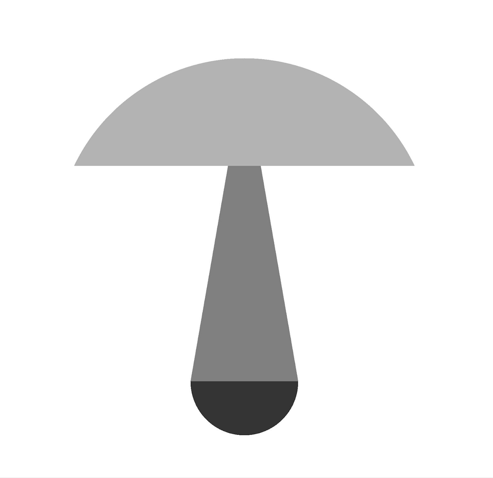
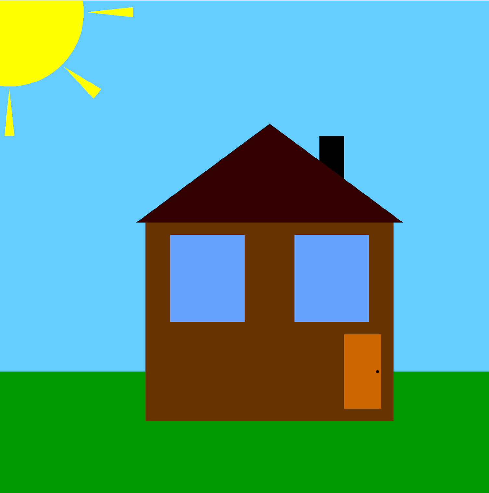

# Object-oriented programming course

## Practice
The source code from practice lessons you can find in the `practice` folder.

## Project
### Mushroom sample


Use the following code for drawing this image:
```c++
int bgColor = 255;
int capColor = 179;
int stipeColor = 128;
int bottomColor = 52;
BWMatrix bw(2000, 2000, 255);
BWColor bwColor(capColor);
Circle cap({1000, 1000}, 700, bwColor);
bwColor.changeColor(bgColor);
Rectangle background({0, 700}, 2000, 1000, bwColor);
Rectangle background2({800, 1300}, 400, 200, bwColor);
bwColor.changeColor(stipeColor);
Triangle stipe({1000, 350}, {1200, 1500}, {800, 1500}, bwColor);
bwColor.changeColor(capColor);
Rectangle background3({800, 350}, 400, 350, bwColor);
bwColor.changeColor(bottomColor);
Circle bottom({1000, 1500}, 200, bwColor);

bw.draw(cap);
bw.draw(background);
bw.draw(bottom);
bw.draw(background2);
bw.draw(stipe);
bw.draw(background3);
bw.display();
```

### House sample


Use the following code for drawing this image:
```c++
RGBMatrix rgb(2000, 2000, 0);
RGBColor rgbColor(102, 205, 255);
Rectangle sky({0, 0}, 2000, 1500, rgbColor);
rgbColor.changeColor(0, 153, 0);
Rectangle grass({0, 1500}, 2000, 2000, rgbColor);
rgbColor.changeColor(255, 255, 0);
Circle sun({50, 50}, 300, rgbColor);
Triangle ray1({360, 50}, {550, 30}, {550, 70}, rgbColor);
Triangle ray2({270, 270}, {420, 360}, {390, 400}, rgbColor);
Triangle ray3({50, 360}, {30, 550}, {70, 550}, rgbColor);
rgbColor.changeColor(102, 51, 0);
Rectangle wall({600, 900}, 1000, 800, rgbColor);
rgbColor.changeColor(0, 0, 0);
Rectangle flue({1300, 550}, 100, 200, rgbColor);
rgbColor.changeColor(51, 0, 0);
Triangle roof({560, 900}, {1100, 500}, {1640, 900}, rgbColor);
rgbColor.changeColor(204, 102, 0);
Rectangle door({1400, 1350}, 150, 300, rgbColor);
rgbColor.changeColor(0, 0, 0);
Circle knob({1535, 1500}, 6, rgbColor);
rgbColor.changeColor(102, 163, 255);
Rectangle window1({700, 950}, 300, 350, rgbColor);
Rectangle window2({1200, 950}, 300, 350, rgbColor);

rgb.draw(sky);
rgb.draw(grass);
rgb.draw(sun);
rgb.draw(ray1);
rgb.draw(ray2);
rgb.draw(ray3);
rgb.draw(wall);
rgb.draw(flue);
rgb.draw(roof);
rgb.draw(door);
rgb.draw(knob);
rgb.draw(window1);
rgb.draw(window2);
rgb.display();
```
